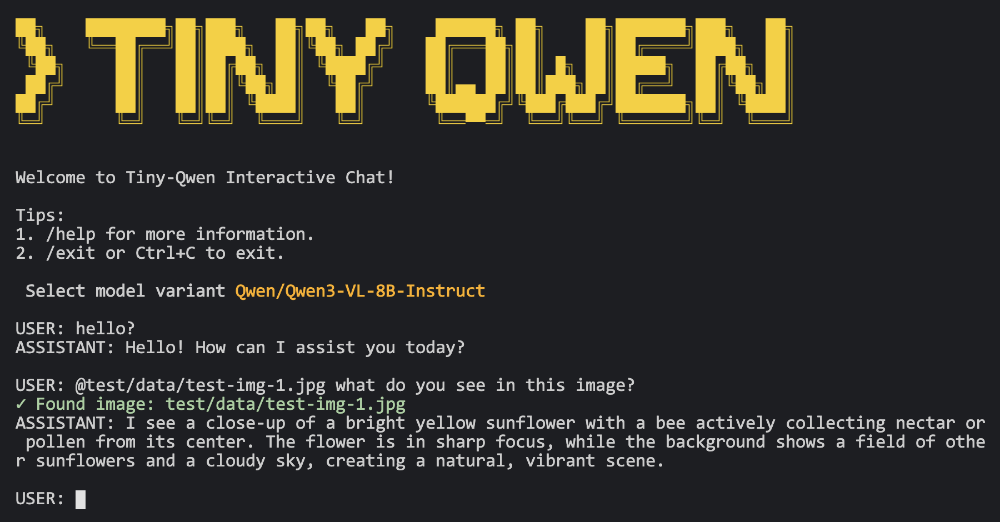

<p align="left">
    中文 | <a href="README.md">English</a>
</p>

<p align="center">
    
</p>

# ✨ Tiny Qwen

一个简洁易读的 PyTorch 代码库，用于重写 `Qwen3-VL`，同时支持文本与视觉模态，并兼容稠密和混合专家架构。

如果你觉得 Hugging Face 的代码难读，那你来对地方了

若需 `Qwen3`（纯文本）与 `Qwen2.5 VL` 支持，请查看[这个 branch](https://github.com/Emericen/tiny-qwen/tree/legacy/qwen2_5)。

若需 `DeepSeek R1`，请查看[这个仓库](https://github.com/Emericen/tiny-deepseek-r1)。

欢迎大家加我的 [Discord ](https://discord.gg/sBNnqP9gaY)继续讨论！

## 🎇 快速开始

推荐使用 `uv` 创建并隔离虚拟环境：

```bash
pip install uv 
uv venv
source .venv/bin/activate
uv pip install -r requirements.txt
```

启动CLI：

```bash
python run.py
```

**注意：** 引用图片要用 `@relative/path/to/image.jpg`。

## 📝 代码示例

使用 `Qwen3VL` 类：

```python
from PIL import Image
from huggingface_hub import snapshot_download
from model.model import Qwen3VL
from model.processor import Processor

image = Image.open("test/data/test-img-1.jpg")

messages = [
    {
        "role": "user",
        "content": [
            {"type": "image", "image": image},
            {"type": "text", "text": "这张图片里有什么？"},
        ],
    },
]

model_name = "Qwen/Qwen3-VL-4B-Instruct"
weights = snapshot_download(repo_id=model_name, cache_dir=".cache")
model = Qwen3VL.from_pretrained(weights_path=weights, device_map="auto")
processor = Processor.from_pretrained(model_name)

device = next(model.parameters()).device
inputs = processor(messages, add_generation_prompt=True, device=device)

output_ids = model.generate(**inputs, max_new_tokens=64)
print(processor.tokenizer.decode(output_ids[0].tolist()))

print("流式输出:", end=" ", flush=True)
for token_id in model.generate_stream(**inputs, max_new_tokens=64):
    print(processor.tokenizer.decode([token_id]), end="", flush=True)
print()
```
